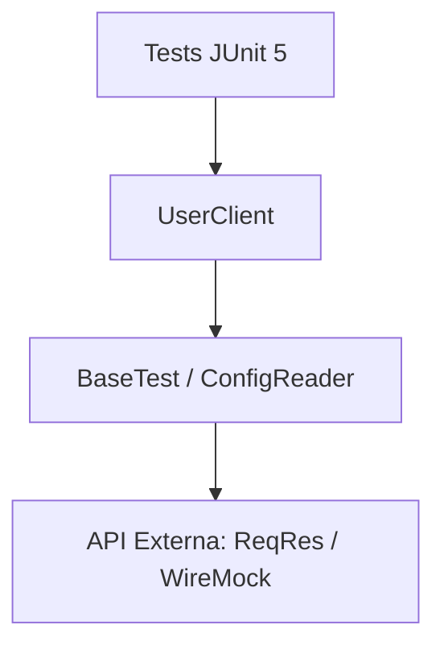
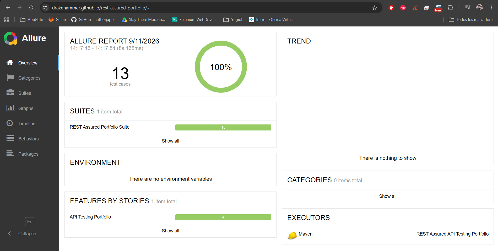
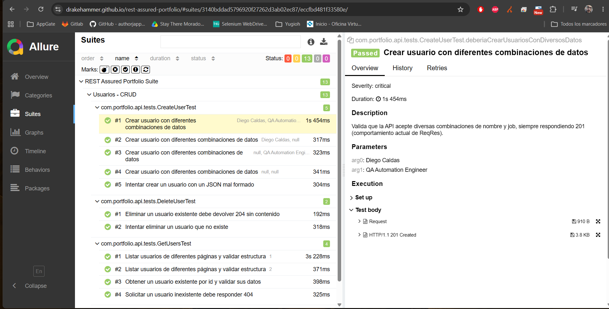

# REST Assured API Testing Portfolio

Suite de pruebas automatizadas de API construida con **REST Assured + Java + JUnit 5**, diseñada como proyecto de portafolio para demostrar habilidades de QA Automation en pruebas de servicios REST.

## 🎯 Objetivo

Validar el comportamiento completo (CRUD) de la API pública [ReqRes](https://reqres.in), aplicando buenas prácticas de automatización usadas en entornos profesionales:

- Separación de configuración (`BaseTest` y `ConfigReader`) y lógica de prueba.
- Implementación de **API Client Pattern** para encapsular llamadas HTTP.
- Validación de esquemas JSON (contratos de API) centralizada.
- **Data-Driven Testing** usando `@ParameterizedTest` y archivos JSON externos.
- POJOs para serialización/deserialización de requests.
- Casos positivos, negativos, de borde (Edge Cases) y simulaciones de fallo (Mocking).
- Reportes visuales con Allure integrados en un Pipeline de CI/CD.
- Anotaciones descriptivas (`@Epic`, `@Feature`, `@Story`, `@Severity`) para trazabilidad.

## 🛠️ Stack técnico

| Herramienta | Uso |
|---|---|
| Java 17 | Lenguaje base |
| REST Assured | Cliente HTTP y aserciones fluidas |
| JUnit 5 | Runner y organización de pruebas |
| AssertJ | Aserciones avanzadas y legibles |
| Jackson | Serialización de POJOs a JSON |
| JSON Schema Validator | Validación de contrato de la API |
| Allure | Reportes de ejecución |
| Maven | Gestión de dependencias y build |
| GitHub Actions | CI/CD y despliegue de reportes |
| WireMock | Simulación de servicios y pruebas de aislamiento |

## 📐 Arquitectura

El proyecto utiliza el **API Client Pattern**, separando la infraestructura de comunicación de la lógica de validación.



Esta estructura permite que los tests sean legibles y que cualquier cambio en la API solo requiera una modificación en el Cliente, no en todos los tests.

## 📁 Estructura del proyecto

```
src/test/java/com/portfolio/api/
├── assertions/
│   └── UserAssert.java          # Aserciones personalizadas con AssertJ
├── base/
│   ├── BaseTest.java            # Configuración común (specs, logging)
│   ├── BaseMockTest.java        # Configuración para WireMock
│   ├── ConfigReader.java        # Carga de propiedades (config.properties)
│   ├── ConditionalLoggingFilter.java # Log inteligente solo en fallos
│   └── SchemaValidator.java     # Helper de validación de contratos
├── clients/
│   └── UserClient.java          # Encapsulamiento de endpoints (API Client Pattern)
├── models/
│   └── User.java                # POJO del payload de usuario
└── tests/
    ├── GetUsersTest.java       # GET: listado, detalle, caso 404
    ├── CreateUserTest.java     # POST: creación de usuario
    ├── UpdateUserTest.java     # PUT: actualización de usuario
    ├── DeleteUserTest.java     # DELETE: eliminación de usuario
    └── MockedUserTest.java      # Pruebas de aislamiento con WireMock
```

src/test/resources/
├── config.properties           # Variables de entorno (URL Base, etc)
├── schemas/                    # Esquemas JSON para validar contratos
└── testdata/                    # Archivos JSON para Data-Driven Testing

## ▶️ Cómo ejecutar las pruebas

Requisitos: Java 17+ y Maven instalados.

```bash
mvn clean test
```

## 📊 Reportes y Evidencia

### Reporte Interactivo (Live)
El proyecto cuenta con un pipeline de CI/CD que despliega automáticamente los resultados en GitHub Pages. Puedes acceder al reporte interactivo aquí:
👉 **[Link al Reporte de Allure](https://drakehammer.github.io/rest-assured-portfolio/)**

### Capturas de Pantalla
- **Dashboard de Allure:** 
- **Detalle de ejecución:** 

## 🧪 Casos cubiertos

- ✅ Listar usuarios paginados y validar esquema de respuesta.
- ✅ Obtener un usuario por id y validar datos consistentes.
- ✅ Manejo de errores 404 para usuarios inexistentes.
- ✅ Crear usuarios con diversos datos (Data-Driven) incluyendo Edge Cases (emojis, strings largos).
- ✅ Validar comportamiento ante payloads mal formados (Casos Negativos).
- ✅ Actualizar y eliminar usuarios validando códigos de respuesta.
- ✅ **Pruebas de Aislamiento (Mocking)**: Simulación de errores 500, Timeouts y JSON corrupto.

---

**Autor:** Diego Fernando Caldas A. — Ingeniero de Sistemas | QA Automation
**LinkedIn:** [diegocaldasafanador](https://www.linkedin.com/in/diegocaldasafanador/) | **GitHub:** [drakehammer](https://github.com/drakehammer)
